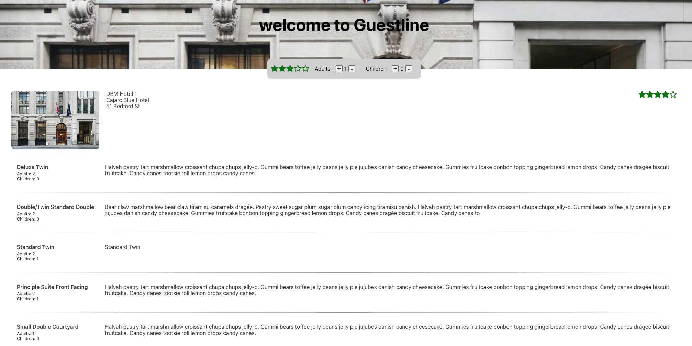

# Guestline-hotel!

## Live

[Watch Live Demo 🔥](https://guestline-hotel.vercel.app/)

### For clone this repository in your machine pest below link in your terminal 👇

```@github/clipboard-copy-element
git clone https://github.com/Milan-960/Guestline-hotel.git
```

### Run below code to install dependency

```@github/clipboard-copy-element
npm install
```

### Run npm start to run the app

```@github/clipboard-copy-element
npm start
```

### API used to filter the data are as below

```@github/clipboard-copy-element
Guestline_API = "https://obmng.dbm.guestline.net/api/hotels?collection-id=OBMNG"
Guestline_RoomRates_API = "https://obmng.dbm.guestline.net/api/roomRates/OBMNG"
```


